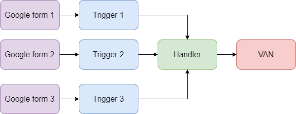

# Google <-> VAN trigger

<b>A simple google script that listens to a trigger from a google form, uses said data to apply a survey response in VAN, and syncs the results to an output
google spreadsheet</b>

## Overview

## Prerequisites

-   A google form that gets at least the following information from the voter. Each value must be a separate field, in the following order:
    -   First name
    -   Last name
    -   House number
    -   Street address
    -   Zip code
    -   Phone number
-   Results linked from the google form to a google sheet: This is the sheet that the script will place VAN IDs into
-   A google [Apps Script](https://script.google.com/home/projects/) project initialised: Appscript is what Google uses to integrate actions into its apps. It
    allows easy access to Google Form triggers which is what we will be using in this scenario.
-   A google [Cloud](https://console.cloud.google.com/functions) project initialised: Google cloud allows us to run cloud functions. These are small snippets of
    code that run when their URL endpoint is called. It has a significant cost savings as it is not a container that is running all the time. It only spins up
    when it needs to. Using Google cloud is the easiest option as we do not have to worry about any code bootstrapping. We simply write the function and let
    Google handle the rest.

# Trigger:

The "trigger" script is a Google App Script that runs every time the form is submitted. It retrieves form data from the form, formats it appropriately and hands
it over to the "handler" to process the VAN side of the request. The handler then returns a VAN ID back to the trigger script that is then added to the output
google sheet by the trigger.

## Setup

1. Create a file called `appscript.json` under <i>Files</i> in the project
2. Copy code from `appscript.json` in this repository to `appscript.json` in your project. Save the file
3. Create a file called `trigger.gs` under <i>Files</i> in the project
4. Copy all code from `trigger.gs` in this repository to `trigger.gs` in your project

## Configuration

In `trigger.gs`, replace:

-   `<GOOGLE FORM ID>` with the ID from the Google Form URL
-   `<GOOGLE SHEET ID>` with the ID from the Google Sheet URL
-   `<GOOGLE SHEET NAME>` with the name of the active sheet in the Google Form responses sheet
-   `<VAN KEY>` with your VAN API key
-   `<VAN SURVEY QUESTION>` with the ID of the survey question from VAN
-   `<VAN SURVEY RESPONSE>` with the ID of the response you want applied to the survey question
-   `<VAN ID COLUMN>` with the column letter in the Google Sheet where you want the VAN IDs to be saved
-   `<VAN CONTACT TYPE ID>` with the ID of the contact type you want associated with the response
-   `<VAN INPUT TYPE ID>` witht the ID of the input type you want associated with the response

## Deployment

-   Once setup and configuration is complete, click run. Make sure to click run only once! Else, you will create multiple triggers for the same form and the
    code will run multiple times, potentially causing errors.
-   For use with another form, copy `trigger.gs` into a new file, say `trigger2.gs` and go through the setup, configuration and deploy steps again. You will
    need one file per form you want to listen to.

# Handler:

The "handler" is a google cloud function that listens for events from the trigger. It takes the data sent to it by the trigger (now properly formatted), finds
the voter based on the information supplied in the form (name, address etc.) and adds the survey question and response defined in the trigger to the voter in
VAN. It then returns the VAN ID of the voter from VAN to the trigger.

## Setup

1. Create a new Google Cloud Function. If prompted to enable APIs, do so.
2. Give the function a name.
3. Select `Allow unauthenticated invocations` under HTTPS options.
4. Configure the runtime and build settings to your liking. I recommend:
    - Default memory and CPU
    - 20 second timeout
    - 1 concurrent requests
    - 0 minimum and 1 maximum number of instances
    - All other defaults
5. Select the runtime as `Python 3.10`.
6. Copy and replace all code in `requirements.txt` from files in this repository
7. Copy and replace all code in `main.py` from code in `handler.py` from this repository
8. Deploy the function and copy its URL
9. Replace `<HANDLER URL>` in your trigger script with this URL

## Deployment

-   You should only need one handler deployed as API keys are passed in from the trigger. If you are seeing performance bottlecks, change the runtime settings
    of the function and redeploy.
